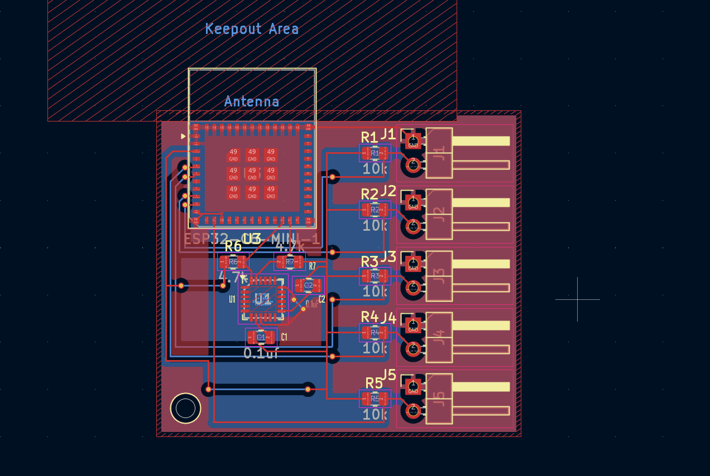

<h1 align="center">
  BdSL Translator Glove
   
</h1>

<h4 align="center">
An wearable smarrt glove that translates Bangladeshi Sign Language (BdSL) into speech in real-time
</h4>

## Overview

Communication is a fundamental right, yet many in the deaf community in Bangladesh face significant barriers. This project is a **sensor based wearable glove** to bridge that gap.

Unlike existing systems that rely on computer vision, this glove uses **integrated sensors** to track hand movements and finger bendings, making it:

-  No external cameras needed
-  Works in any lighting condition
-  Built specifically for Bangladeshi Sign Language

## Key Features

- **Dual-Hand Tracking** - ESP32-C6-Mini processes data from 5 flex sensors + MPU-6050 IMU
- **Compact Design** - Custom PCB placed in 3D-printed "Wrist Hub"
- **Custom Dataset** - We are willing to make our specific dataset for BdSL
- **Wireless Ready** - Wi-Fi 6, Bluetooth 5

## How to Use This Project

1. Print the 3D enclosure and assemble the custom PCB.
2. Use the `firmware.cpp` to the ESP32-C6 to begin collecting sensor data.
3. The flex sensors and IMU will give the hand gesture output as in csv format with finger bendings and hand poisitioning. 

## Design

Designed in KiCad and Fusion 360 for PCB and Enclosure

### PCB

Designed in KiCad with multi-layer board and antenna keep-out zone

**Schematic:**

**PCB Layout:**

**PCB 3D View:**

### Wrist Hub Enclosure

Designed in Fusion 360 for maximum portability

**Box Case:**

## Assembly:

**Sensors assembly:**

**Wiring Diagram:**

### ✅ Design Verification

**KiCad DRC Results (0 Errors):**
The PCB design passed the Design Rule Checker with 0 errors, but it has 2 warnings and these warnings are just for a slikscreen border on the antena area.

### Hardware Wiring

**Voltage Divider Configuration:**
The flex sensors are wired in a pull-down configuration to ensure stable ADC readings:

- 🔴 **Red Wire**: 3.3V Power to Sensor
- 🟢 **Green Wire**: Signal from Sensor to ESP32 ADC pin
- ⚫ **Black Wire**: path to Ground (GND)

## Bill of Materials

| Component / Part | Qty | Value / Specs | Link | Cost (BDT) |
| :--- | :--- | :--- | :--- | :--- |
| ESP32-C6-MINI-1 | 2 | Wi-Fi/BLE MCU | [Shop Link](https://store.roboticsbd.com/internet-of-things-iot/3855-esp32-c6-supermini-development-board-wifi-6-bluetooth-5-le-risc-v-32-bit-robotics-bangladesh.html) | 620x2 = 1240 |
| MPU-6050 | 2 | 6-DoF IMU | [Shop Link](https://store.roboticsbd.com/robotics-parts/104-6dof-accelerometer-gyroscope-gy-521-mpu-6050-robotics-bangladesh.html) | 360x2 = 720 |
| Resistor | 10 | 10kΩ | [Shop Link](https://store.roboticsbd.com/resistor/243-10k-ohm-14w-carbon-film-resistor-pack-of-10-robotics-bangladesh.html) | 15 |
| Resistor | 4 | 4.7kΩ | [Shop Link](https://robodocbd.com/product/4.7k-ohm-1-4w-resistor?srsltid=AfmBOooYe4Ffau6c5tj1ZHqSFBkdW1RNqfQV6cVdxJ_YH-f_rlnICQig) | 10 |
| Capacitor | 4 | 0.1uF | [Shop Link](https://store.roboticsbd.com/capacitor/2280-01uf-50v-capacitor-robotics-bangladesh.html) | 12 |
| Male Header Pins | 10 | 1x02 Pin | [Shop Link](https://store.roboticsbd.com/connector/653-male-pin-header-single-row-l-shaped-robotics-bangladesh.html) | 18 |
| Flex Sensors | 10 | 4.5 inch | [Shop Link](https://www.electronics.com.bd/sensors/flex-sensor-4-5?srsltid=AfmBOorxq734_F29vBK2kye2oFEvBfQKv7jxRflG7IaUrFKZaXeHipuE) | 2062x10 = 20620 |
| Custom PCB | 2 | 2 layer | [JLCPCB](https://jlcpcb.com/) | - |
| LiPo Battery | 2 | 3.7V (~1000mAh) | [Shop Link](https://store.roboticsbd.com/quadcopter/2861-37v-1000mah-25c-lipo-battery-robotics-bangladesh.html) | 540x2 = 1080 |
| Glove Material | 2 | Breathable Fabric | - | - |
| **Total Estimation** | | | | **~205 USD (includes PCB, Enclosure & other expected cost)** |

### Approximate cost : 205 usd

## Roadmap

### Phase 1: Hardware Validation (Current)
Currently working to creating the hardware parts. We are focusing on making it better to use not just a prototype.

### Phase 2: Data Collection
We are planning to collaborate with a deaf community, most probably Bangladesh national federation of the deaf.
We want to collaborate to make it better by working with practical data and deaf people to make a proper impact.

### Phase 3: ML Model Development
- Train gesture recognition model
- Optimize for ESP32-C6 inference
- Achieve >90% accuracy on test set

## > Currentlly we are working on the coding part || **Coding Partner** [Kishor](https://github.com/kishor1594)

### Hackclub Project and journals [HackClub](https://blueprint.hackclub.com/projects/11759)

## Credits

This project uses:
- [KiCad](https://www.kicad.org/) for PCB design
- [Autodesk Fusion 360](https://www.autodesk.com/products/fusion-360/) for enclosure design
- [Hack Club](https://hackclub.com/) for support and inspiration

---

**Built to empower the deaf community in Bangladesh**

> GitHub [@Adnanosman](https://github.com/Adnanosman9)

