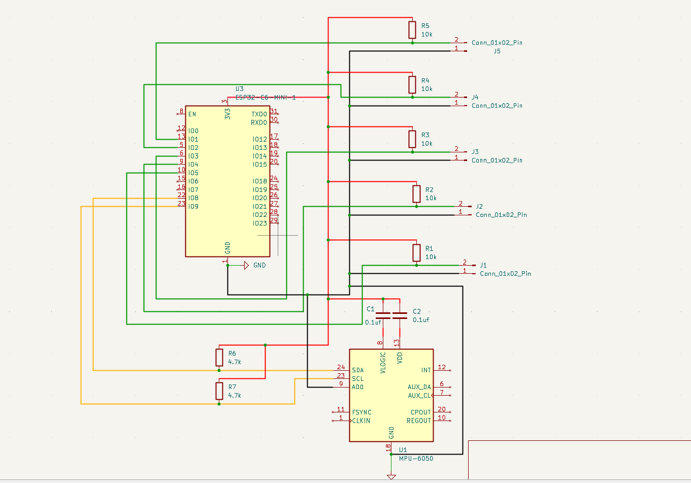
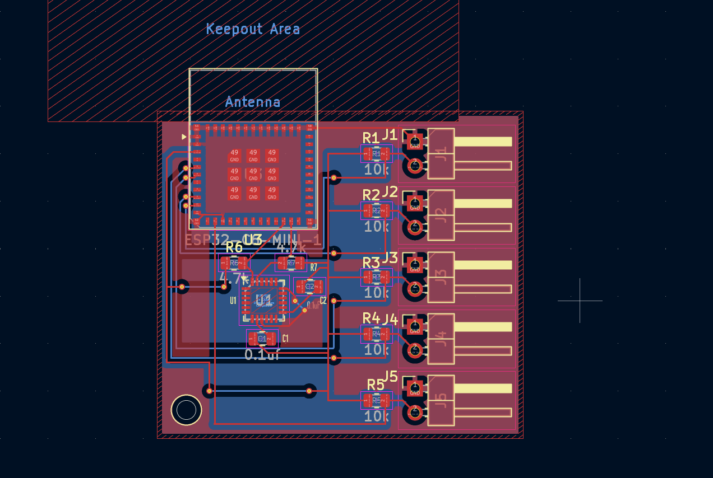

<h1 align="center">
  BdSL Translator Glove
   
</h1>

<h4 align="center">
An wearable smarrt glove that translates Bangladeshi Sign Language (BdSL) into speech in real-time
</h4>

## What is this?
A lot of deaf people in Bangladesh can't easily communicate with those who don't know sign language. This project tries to fix that, not with cameras or computer vision, but with sensors built directly into a glove. That means it works in any lighting, doesn't need a phone pointed at you, and is actually portable.

## How it works
The glove uses **5 flex sensors** (one per finger) plus an **MPU-6050 IMU** on the wrist to capture hand position and finger bends. An **ESP32-C6-Mini** processes the data and outputs it as CSV, finger bend values + orientation, which can then be fed into a classifier to recognize BdSL signs.

## Design

Designed in KiCad and Fusion 360 for PCB and Enclosure

### PCB

Designed in KiCad with multi-layer board and antenna keep-out zone

**Schematic:**

**PCB Layout:**

**PCB 3D View:**

### Wrist Hub Enclosure

Designed in Fusion 360 for maximum portability

**Box Case:**

## Assembly:

**Sensors assembly:**

**Wiring Diagram:**

### ✅ Design Verification

**KiCad DRC Results (0 Errors):**
The PCB design passed the Design Rule Checker with 0 errors, but it has 2 warnings and these warnings are just for a slikscreen border on the antena area.

### Hardware Wiring

**Voltage Divider Configuration:**
The flex sensors are wired in a pull-down configuration to ensure stable ADC readings:

- 🔴 **Red Wire**: 3.3V Power to Sensor
- 🟢 **Green Wire**: Signal from Sensor to ESP32 ADC pin
- ⚫ **Black Wire**: path to Ground (GND)

### Enclosure
* Designed in **Fusion 360**. 
* Low-profile box that sits on the wrist. 
* The electronics module detaches from the glove via Velcro straps, so you can actually wash the fabric.

### Sensor Mounting
* Flex sensors slide into sewn fabric channels on each finger so they can flex naturally without stressing the traces.

## Bill of Materials

| Component / Part | Qty | Value / Specs | Link | Cost (BDT) |
| :--- | :--- | :--- | :--- | :--- |
| ESP32-C6-MINI-1 | 2 | Wi-Fi/BLE MCU | [Shop Link](https://store.roboticsbd.com/internet-of-things-iot/3855-esp32-c6-supermini-development-board-wifi-6-bluetooth-5-le-risc-v-32-bit-robotics-bangladesh.html) | 620x2 = 1240 |
| MPU-6050 | 2 | 6-DoF IMU | [Shop Link](https://store.roboticsbd.com/robotics-parts/104-6dof-accelerometer-gyroscope-gy-521-mpu-6050-robotics-bangladesh.html) | 360x2 = 720 |
| Resistor | 10 | 10kΩ | [Shop Link](https://www.electronics.com.bd/fixed-resistors/resistor-10k-ohm-0-25w) | 15 |
| Resistor | 4 | 4.7kΩ | [Shop Link](https://www.electronics.com.bd/fixed-resistors/resistor-4-7k-ohm-0-25w) | 10 |
| Capacitor | 4 | 0.1uF | [Shop Link](https://store.roboticsbd.com/capacitor/2280-01uf-50v-capacitor-robotics-bangladesh.html) | 12 |
| Male Header Pins | 10 | 1x02 Pin | [Shop Link](https://store.roboticsbd.com/connector/653-male-pin-header-single-row-l-shaped-robotics-bangladesh.html) | 18 |
| Flex Sensors | 10 | 4.5 inch | [Shop Link](https://www.electronics.com.bd/sensors/flex-sensor-4-5?srsltid=AfmBOorxq734_F29vBK2kye2oFEvBfQKv7jxRflG7IaUrFKZaXeHipuE) | 2062x10 = 20620 |
| Custom PCB | 2 | 2 layer | [JLCPCB](https://jlcpcb.com/) | - |
| LiPo Battery | 2 | 3.7V (~1200mAh) | [Shop Link](https://www.electronics.com.bd/lipo-battery/li-ion-battery-1200mah-3-7v-1-cell) | 455x2 = 910 |
| Glove Material | 2 | Breathable Fabric | - | - |
| **Total Estimation** | | | | **~205 USD (includes PCB, Enclosure & other expected cost)** |

### Approximate cost : 205 usd (Costs may vary over time)

## ⚠ Caution
 
> The firmware has not been physically tested yet. There may be issues like I2C pin mismatches (SDA/SCL), wrong GPIO assignments, or sensor initialization errors that only show up on real hardware. Double-check all pin numbers against the schematic before flashing, and expect some debugging on first boot.
## Credits

This project uses:
- [KiCad](https://www.kicad.org/) for PCB design
- [Autodesk Fusion 360](https://www.autodesk.com/products/fusion-360/) for enclosure design
- [Hack Club](https://hackclub.com/) for support and inspiration

---

> GitHub [@Adnanosman](https://github.com/Adnanosman9)

