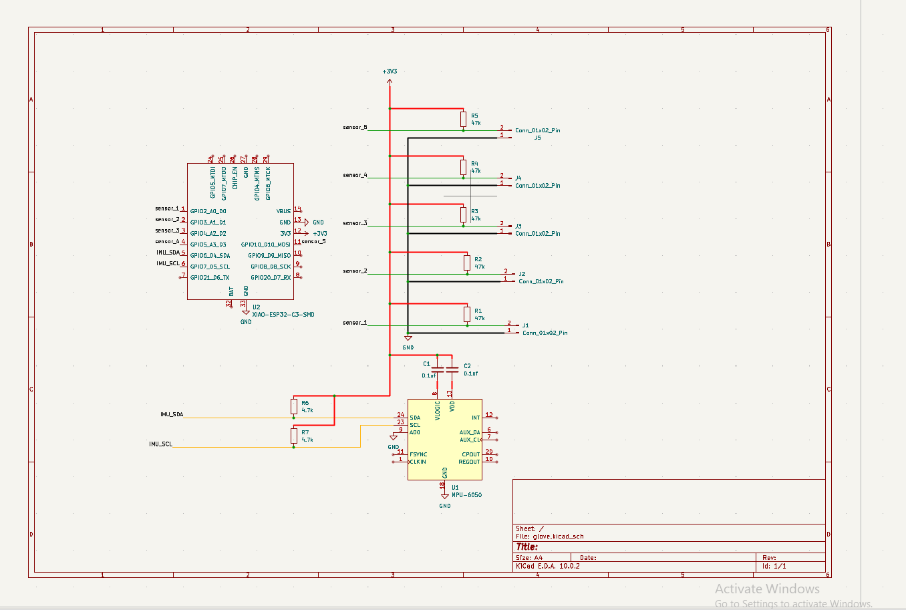
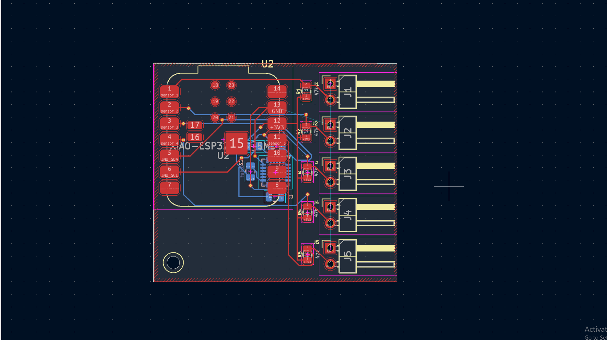
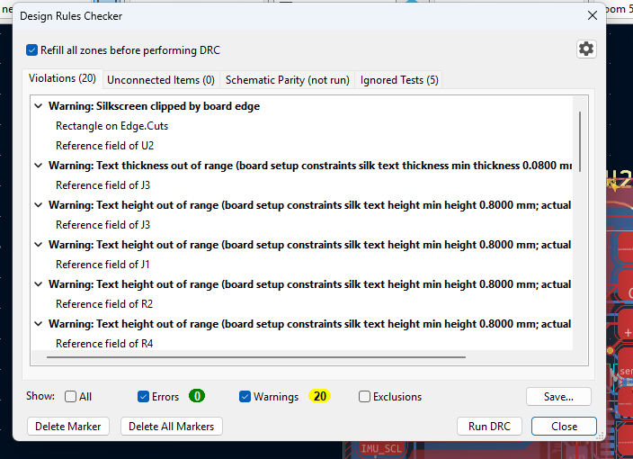

<h1 align="center">
  BdSL Translator Glove
   
</h1>

<h4 align="center">
An wearable smarrt glove that translates Bangladeshi Sign Language (BdSL) into speech in real-time
</h4>

## What is this?
A lot of deaf people in Bangladesh can't easily communicate with those who don't know sign language. This project tries to fix that, not with cameras or computer vision, but with sensors built directly into a glove. That means it works in any lighting, doesn't need a phone pointed at you, and is actually portable.

## How it works
 
The glove supports two sensing approaches depending on what you have access to:
 
**1. Commercial flex sensors (recommended)**
Five 2.2" flex sensors run along each finger, held in place by custom 3D-printed TPU guide segments. As each finger bends, the sensor's resistance shifts and gets picked up by the ADC.
 
**2. Conductive TPU (if you have your own 3D printer)**
The finger segments can be printed directly in Conductive TPU, acting as flex sensors through the piezoresistive effect, resistance changes as the filament bends. No separate sensor needed. The catch is that no commercial print service supports conductive TPU filament, so this only works if you have your own printer and the filament.
 
Either way, a **XIAO ESP32-C3** reads those values alongside orientation data from an **MPU-6050** IMU, maps them into a hand-geometry profile, and classifies the result into BdSL signs, transmitted over Bluetooth LE.
 
No cameras. Works in any lighting, anywhere.

Just print either [for flex sensors](https://github.com/Adnanosman9/Smart-Gloves/tree/main/CAD%20for%20flex%20sensor) or [for 3d printed sensor](https://github.com/Adnanosman9/Smart-Gloves/tree/main/CAD_3d%20printed%20sensor)

## Addressing the Hack Club Review
 
The previous version of this project got two pieces of feedback:
 
> *"$80 seems a bit much for flex sensors"* and *"your CAD only shows a box, could you maybe design some flexible structure out of TPU?"*
 
Both fair points. Here's what changed:
 
**On the sensors:** Flex sensors are just expensive, there's no way around it. BdSL uses both hands, so that's 10 fingers, 10 sensors. The cheapest viable 2.2" option is ~$8/sensor, which puts the total at $80. That's already the budget option. The $80 isn't extravagant; it's the floor.
 
**On the CAD:** A finger exoskeleton was added in repo, TPU guide segments per finger that hold each flex sensor flat against the joint. Standard white TPU, printable by any FDM service. The wrist hub box is still there, but the glove now actually looks like a glove.

## Engineering Highlights
 
### Dual-Material Exoskeleton (Fusion 360)
 
The finger segments are FDM-printed in two materials simultaneously:
 
- **White TPU**: flexible structural base, comfortable to wear
- **Black Conductive TPU**: integrated sensing traces that shift resistance with bend angle
Segments come in two geometries ("Long" and "Short") to fit fingers anatomically, including the thumb and pinky.
 

# Notice⚠️
## Why not 3D-printed sensors?
The original plan was to print the sensors directly from Conductive TPU using the piezoresistive effect, no commercial sensors needed. The problem is that no commercial 3D printing service actually supports conductive TPU filament, so you'd need your own printer and the filament to pull it off.
Instead, the exoskeleton uses standard white TPU guide segments that hold 2.2" commercial flex sensors in the correct position along each finger joint. Same result, actually reproducible.

## Engineering Highlights
Finger Guide System from [zackfreedman](https://www.thingiverse.com/thing:1606915) 
Find the design [here](https://github.com/Adnanosman9/Smart-Gloves/blob/main/CAD%20for%20flex%20sensor/Ring_Glove_Parametric.stl)

Each finger uses TPU guide segments that form a channel, keeping the flex sensor flat and correctly angled against the joint. The sensor slides in and is retained mechanically. no adhesive needed.

White TPU - flexible, comfortable, printable by any FDM service
Two segment sizes: "Long" for index, middle, and ring fingers; "Short" for thumb and pinky

Designed in KiCad and Fusion 360 for PCB and Enclosure

### Custom PCB (KiCad)
 
A low-profile wrist hub houses all electronics, with a few deliberate design choices:

- **Xiao ESP32-C3** used for high-speed transmission in a small size. 
- **47kΩ voltage divider** network tuned for high-impedance sensor readings
- **0.1µF decoupling caps** to filter noise from the printed traces
DRC: 0 errors.

**Schematic:**

**PCB Layout:**

### Wrist Hub Enclosure

Designed in Fusion 360 for maximum portability

**Box Case:**

### ✅ Design Verification

**KiCad DRC Results (0 Errors):**
The PCB design passed the Design Rule Checker with 0 errors, but it has warnings and these warnings are just for a slikscreen text warning.

### Enclosure
* Designed in **Fusion 360**. 
* Low-profile box that sits on the wrist. 
* The electronics module detaches from the glove via Velcro straps, so you can actually wash the fabric.

## Bill of Materials

[BOM](bom/BOM.csv) is here. 

## ⚠ Caution
 
> The firmware has not been physically tested yet. There may be issues like I2C pin mismatches (SDA/SCL), wrong GPIO assignments, or sensor initialization errors that only show up on real hardware. Double-check all pin numbers against the schematic before flashing, and expect some debugging on first boot.
## Credits

This project uses:
- [KiCad](https://www.kicad.org/) for PCB design
- [Autodesk Fusion 360](https://www.autodesk.com/products/fusion-360/) for enclosure design
- [Open print sense](https://github.com/PaBu04/OpenPrintSense/tree/main) for the 3d printed sensor design
- [Hack Club](https://hackclub.com/) for support and inspiration

---

> GitHub [@Adnanosman](https://github.com/Adnanosman9)

